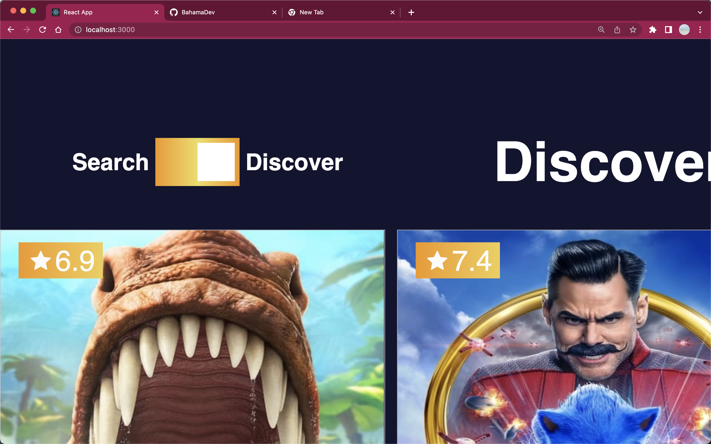
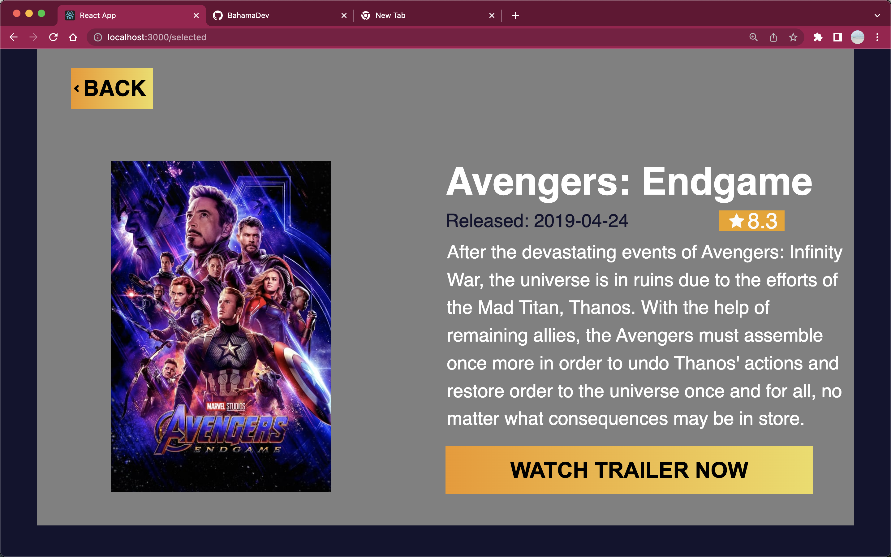

# Movie Trailer App

Whether your a scifi lover, or a romantic this eye catching, easy to use movie trailer app built with the TMDB API will allow you to browse or search thousands of movies, and view their trailers. Use this to plan your next few movie nights.

## Tech:

- ReactJs
- HTML
- CSS
- Javascript
- NPM
- TMDB API

## How To:

Using the app is simple and straight forward.

Use the mode switch to choose between Discover and Search modes.

Click on a poster to learn more about movie and to view it's trailer.

-Discover Mode: This mode allows you to browse to your hearts content. Movies are automatically presented based on latest releases and popularity.

-Search mode: Search mode can be activated using the mode switch, or by typing in the search input field. Movies are presented based on the input given. In this mode, the number of search results are displayed at the top of the page.

## Developer's Notes:

Ahhhh React JS! How I am growing to love thee and understand thee more and more.

This MVP was a great exploration of some of the core components and features of React. Though there are many similar builds around I used this project to test my growing understanding of React and intentionally did not follow any templates or refer to any tutorials of similar builds. Twas a good challenge!
